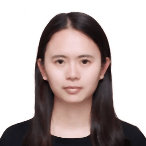

# Image-Morphing

A project that implements image morphing techniques to create smooth transitions between images using tie points. The project supports both manual and automated tie point selection methods.

📌 Examples

1️⃣ Face Morphing (Manual Tie Points)  

2️⃣ Face Morphing (Dlib-Generated Tie Points)  

3️⃣ Tiger to Human Morphing (Manual Tie Points)  

